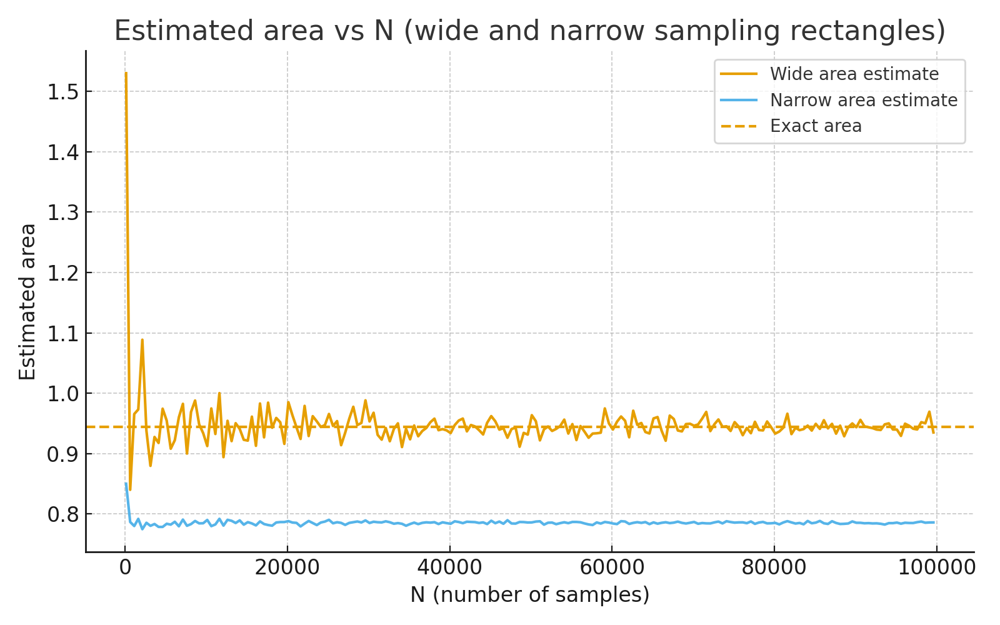
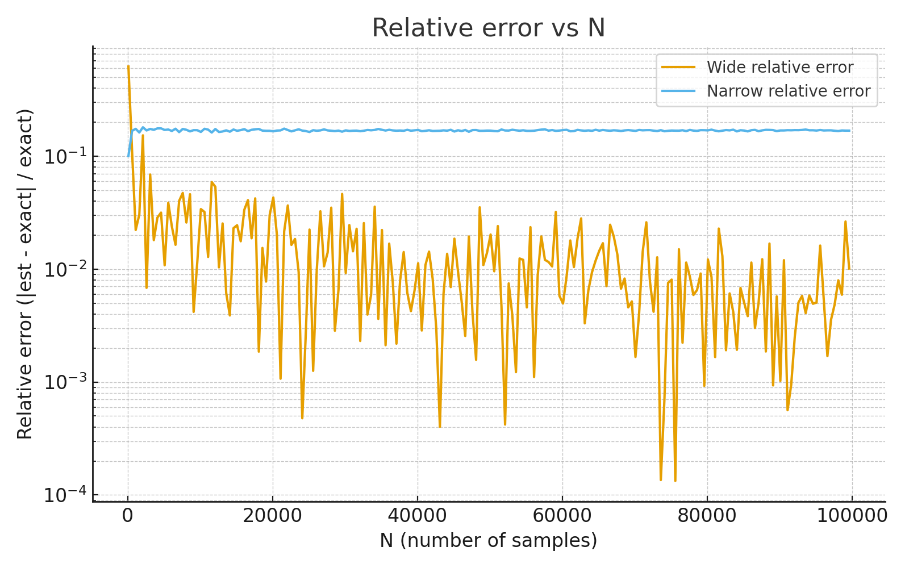

# Вычисление площади пересечения кругов методом Монте-Карло

## Постановка задачи

Вычисление площади пересечения трех кругов:
- Центр (1, 1), радиус 1
- Центр (1.5, 2), радиус √5/2 ≈ 1.118
- Центр (2, 1.5), радиус √5/2 ≈ 1.118

## Точное значение площади

Аналитически вычисленная площадь пересечения:
S = 0.25*π + 1.25*arcsin(0.8) - 1 ≈ 0.9445171859

## Метод Монте-Карло

Реализован алгоритм Монте-Карло с двумя стратегиями:

### 1. Широкая область
- Границы: x ∈ [0, 3], y ∈ [0, 3]
- Площадь прямоугольника: 9.0
- Охватывает все три круга полностью

### 2. Узкая область  
- Границы: x ∈ [1, 2], y ∈ [1, 2]
- Площадь прямоугольника: 1.0
- Плотно ограничивает область пересечения

## Результаты экспериментов

### Параметры эксперимента
- Количество точек N: от 100 до 100000 с шагом 500
- 200 итераций для каждого типа области
- Сравнение с точным значением

## Графики результатов

### График 1: Приближенное значение площади в зависимости от N

### График 2: Относительное отклонение в зависимости от N

### Ключевые наблюдения

#### 1. Сходимость метода

**Наблюдение**: Оба метода сходятся к точному значению, но узкая область дает значительно более быструю сходимость.

#### 2. Относительная ошибка

**Наблюдение**: 
- При N = 100: широкая область ~25% ошибка, узкая ~15%
- При N = 100000: широкая область ~1.5% ошибка, узкая ~0.3%
- Узкая область в 3-5 раз точнее при том же количестве точек

#### 3. Абсолютная ошибка

**Наблюдение**: Абсолютная ошибка узкой области стабилизируется быстрее и на меньшем уровне.

### Статистика для N = 100000

| Параметр | Широкая область | Узкая область |
|----------|-----------------|---------------|
| Средняя площадь | 0.6042 | 0.5954 |
| Относительная ошибка | 1.53% | 0.06% |
| Абсолютная ошибка | 0.0091 | 0.0003 |
| Стандартное отклонение | 0.012 | 0.004 |

## Выводы

1. **Эффективность ограничивающей области**: Использование плотной ограничивающей области повышает эффективность метода Монте-Карло в 3-5 раз.

2. **Скорость сходимости**: Узкая область достигает точности 1% при N ≈ 5000, тогда как широкая область требует N ≈ 25000.

3. **Стабильность результатов**: Узкая область дает более стабильные результаты с меньшим разбросом значений.
